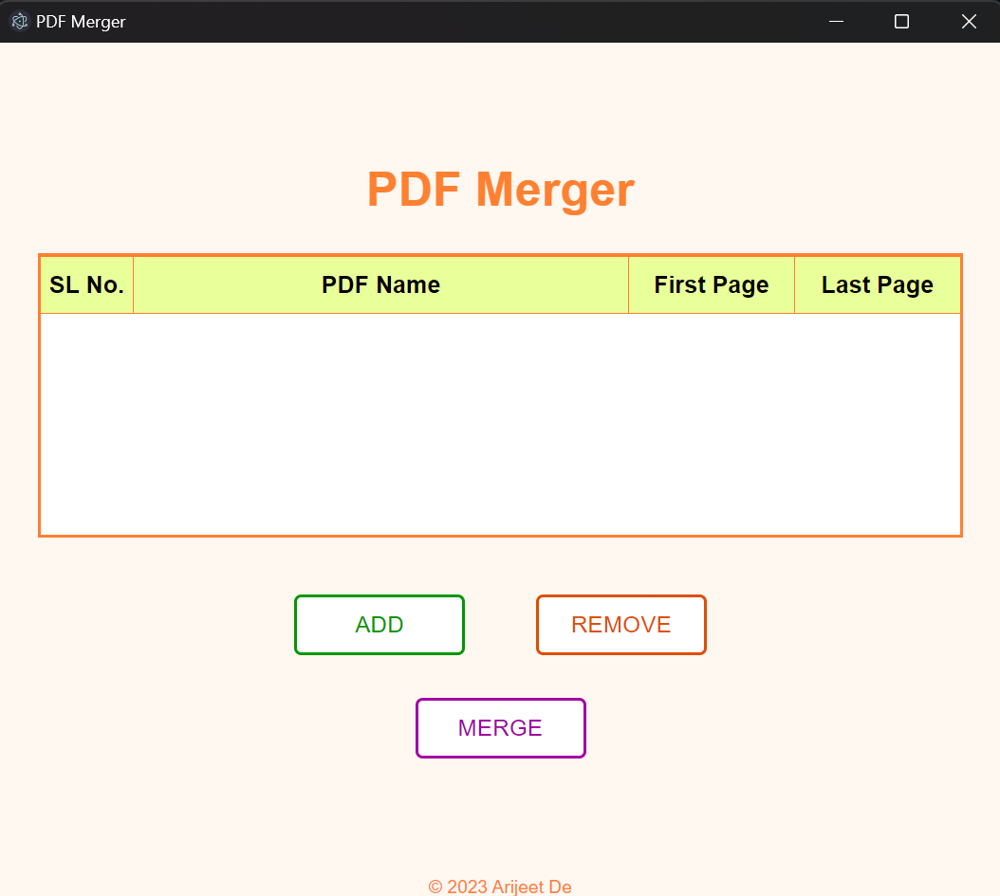
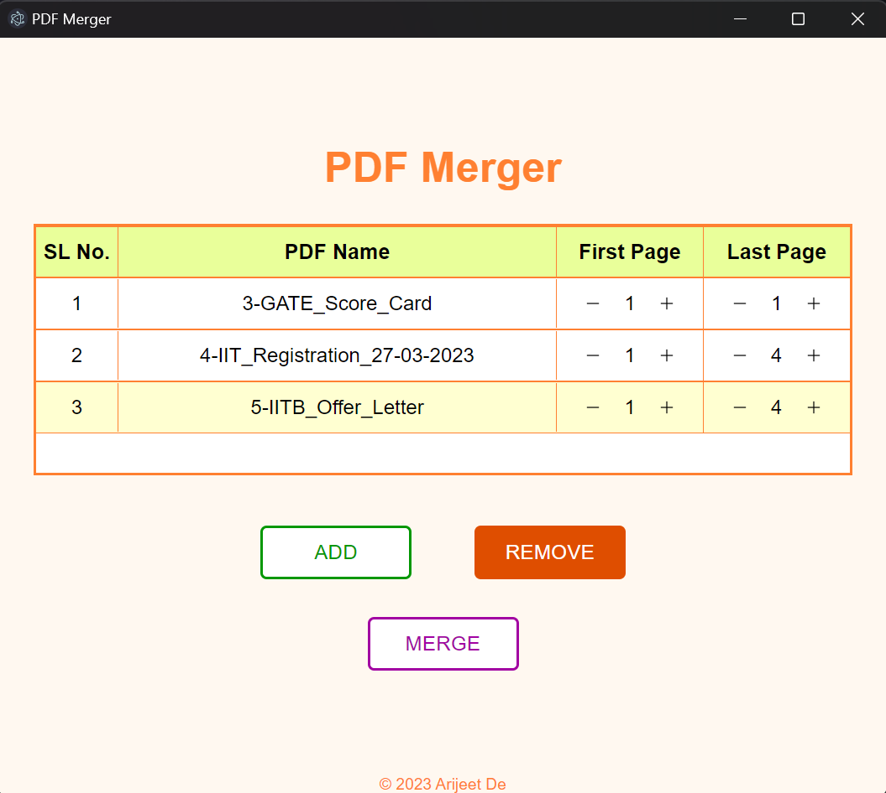
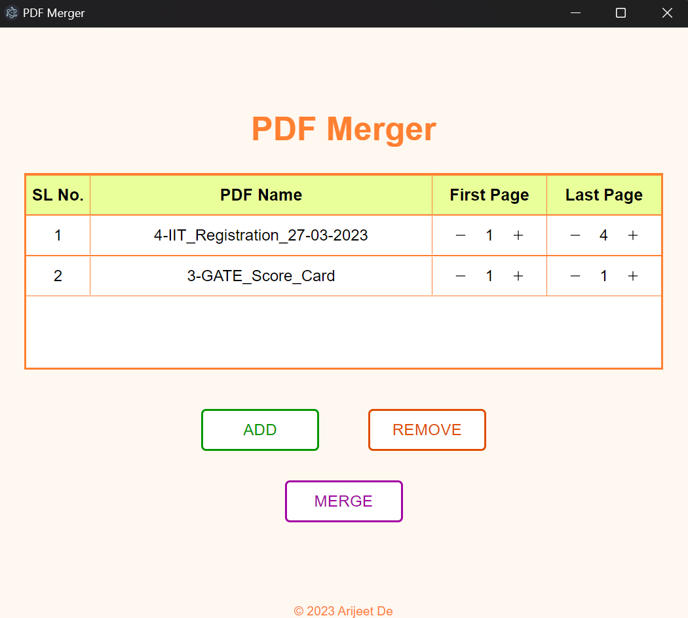
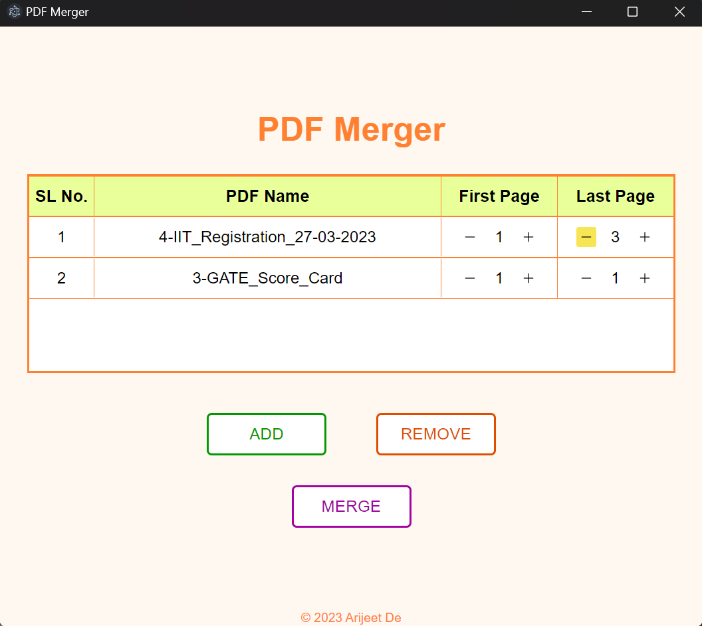

# PDF Merger

A desktop app to merge pdf files.  
Created using [ElectronJS](https://www.electronjs.org/).

## Basic View of App

## How to?

### 1. Add Files:

* Click on `ADD BUTTON`.
* File Explorer will open.
* Select the files.
* Click open in file explorer.

### 2. Remove Files:

* Select the file record.
* It will get highlighted in yellow.
* Click on `REMOVE BUTTON`.

### 3. Rearrange Files:

Drag the file record to which ever position you want.

### 4. Specify Page Range:

Click on `-` and `+` button to set page range for the corresponding file record.

### 5. Merge Files:

* Click on `MERGE BUTTON`.
* File Explorer will open.
* Decide location of save.
* Give name to your merged file.
* Click save in file explorer.

## Author

- Name: Arijeet De
- GitHub - [@debroglie27](https://github.com/debroglie27)
- Frontend Mentor - [@debroglie27](https://www.frontendmentor.io/profile/debroglie27)
- Facebook - [@arijeet.de](https://www.facebook.com/arijeet.de)
- Instagram - [@121debroglie](https://www.instagram.com/121debroglie/)
